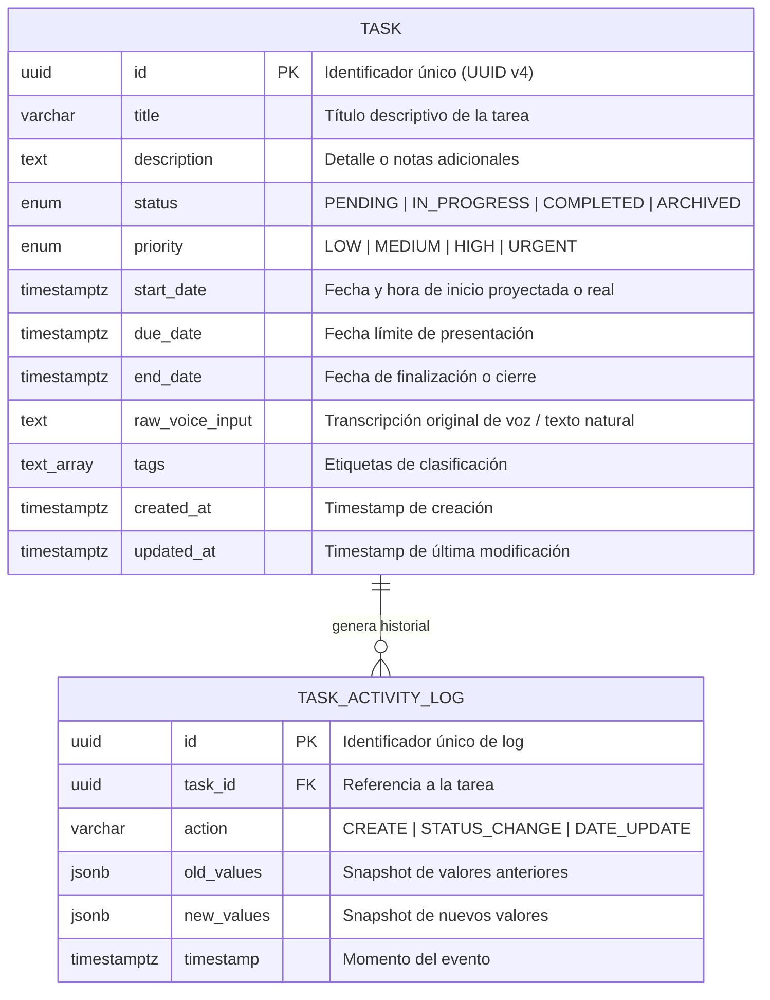

# Entity-Relationship Specification (ER Model)

## 1. Mermaid Entity-Relationship Diagram

---

## 2. Data Dictionary

### Tabla: `tasks`
| Campo | Tipo | Nulo | Default | Descripción |
| :--- | :--- | :---: | :--- | :--- |
| `id` | `UUID` | No | `uuid_generate_v4()` | Clave primaria. |
| `title` | `VARCHAR(255)` | No | - | Nombre sintetizado de la tarea. |
| `description` | `TEXT` | Sí | `NULL` | Contexto, especificaciones o enlaces. |
| `status` | `ENUM` | No | `'PENDING'` | Estado dentro del flujo Kanban. |
| `priority` | `ENUM` | No | `'MEDIUM'` | Nivel de criticidad. |
| `start_date` | `TIMESTAMPTZ` | Sí | `NULL` | Momento en el que se comienza a ejecutar. |
| `due_date` | `TIMESTAMPTZ` | Sí | `NULL` | Deadline o fecha de entrega/presentación. |
| `end_date` | `TIMESTAMPTZ` | Sí | `NULL` | Momento de cierre definitivo. |
| `raw_voice_input` | `TEXT` | Sí | `NULL` | Frase textual ingresada antes del NLP. |
| `tags` | `TEXT[]` | No | `ARRAY[]` | Categorías o etiquetas contextuales. |
| `created_at` | `TIMESTAMPTZ` | No | `now()` | Fecha y hora de inserción. |
| `updated_at` | `TIMESTAMPTZ` | No | `now()` | Fecha y hora de última edición. |

---

## 3. Business Integrity Rules & Constraints
1. **Validación Temporal Lógica:**
   - Si `start_date` y `due_date` existen: $\text{start\_date} \le \text{due\_date}$.
   - Si `start_date` y `end_date` existen: $\text{start\_date} \le \text{end\_date}$.
2. **Transiciones de Estado:**
   - Al cambiar a `COMPLETED`, si `end_date` es nulo, el sistema asigna por defecto `end_date = CURRENT_TIMESTAMP`.
